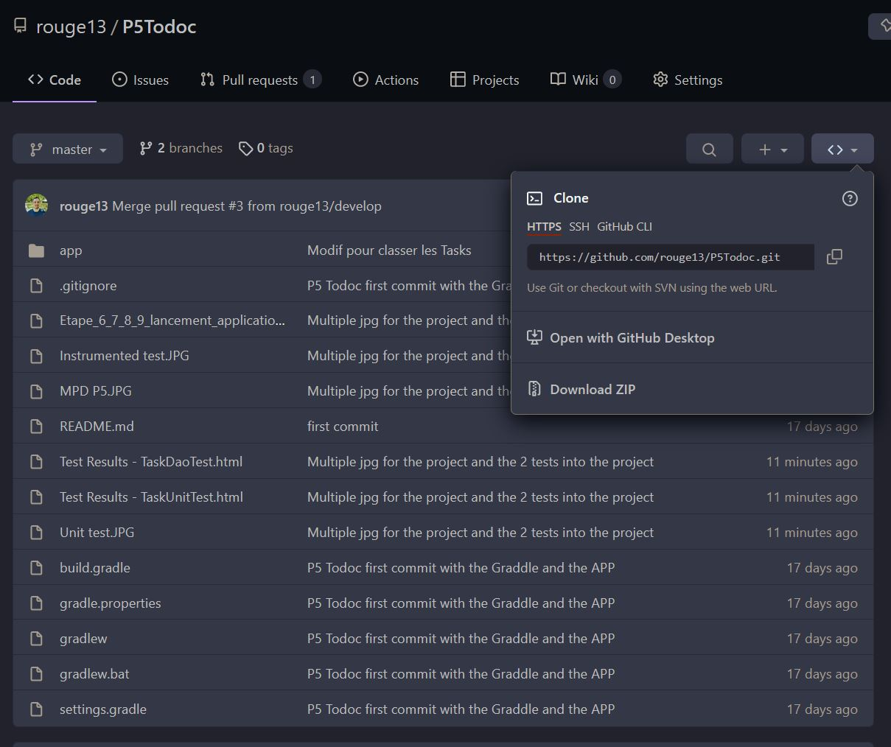
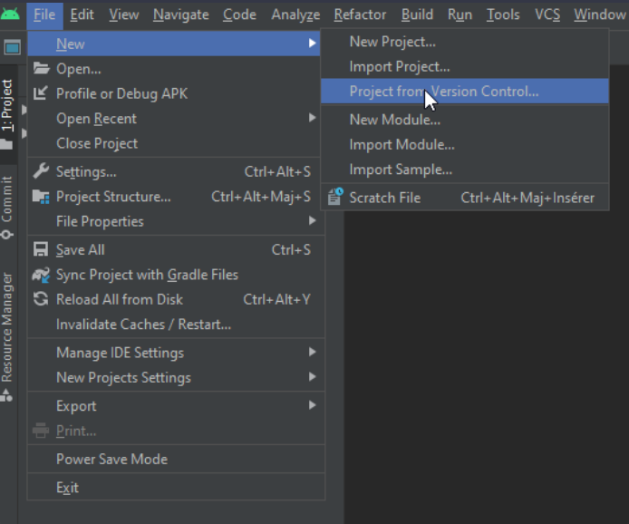
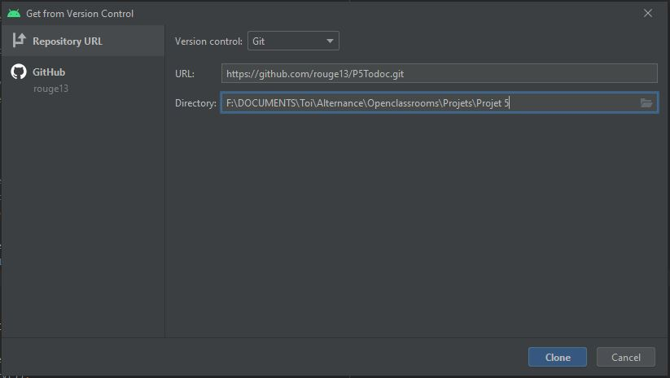
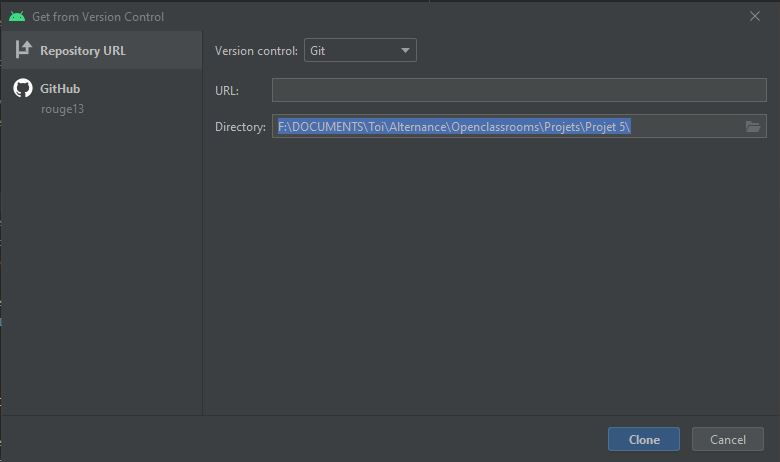
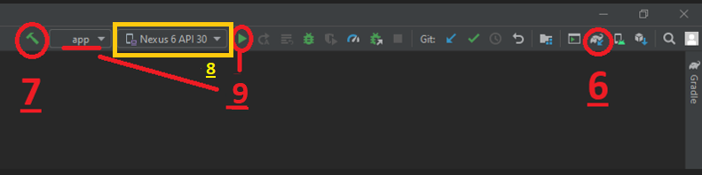
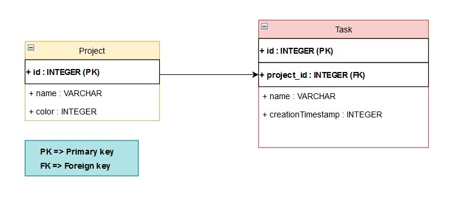
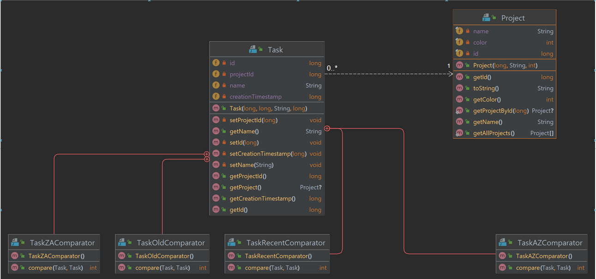
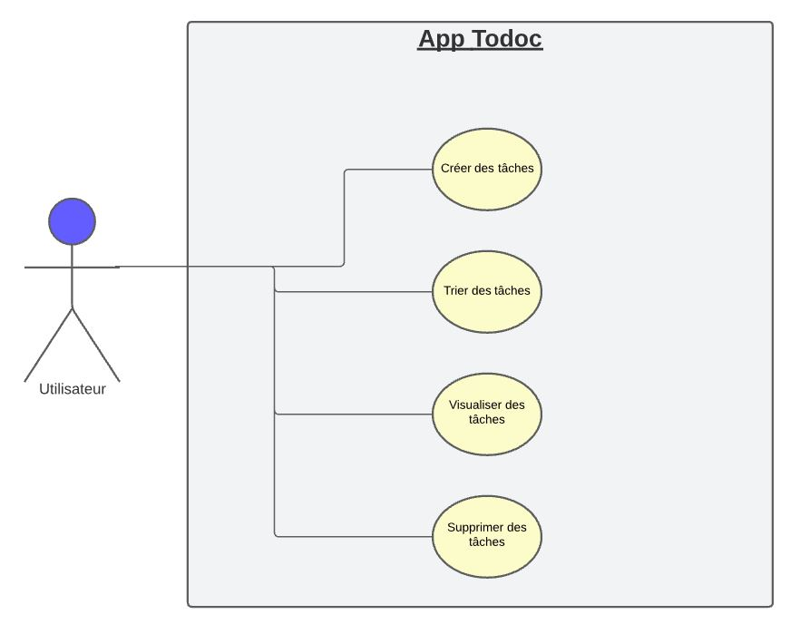

# **Projet N°5 : "Todoc" OPENCLASSROOMS**
_________________________________________________________________________________________________________________

Ce dépot contient une mini-application pour le Projet 5 du parcours Grande École du Numérique pour le cursus Développeur d'Application Android

## Introduction de ce projet

"Todoc" est une application qui permet la visualisation des tâches et leurs gestion dans l'entreprise Cleanup et qui comprend l'identifiant, le nom, projet associé et son timestamp de création concernant trois projets.
_________________________________________________________________________________________________________________

## Android Studio et lien vers le projet **"Todoc"**
_________________________________________________________________________________________________________________
### 1. Installation et paramétrage d’Android Studio :  **[Lien d'installation](https://developer.android.com/studio)**
Avant de procéder à l’installation, identifiez le système d'exploitation de votre ordinateur. Si vous avez besoin d’aide pour l'installation et le paramétrage du logiciel, vous pouvez utiliser ce **[tutoriel](https://www.tutorialspoint.com/android/android_studio.htm)** en ligne

### 2. Téléchargez le code du projet avec git clone : **via ce [lien](https://github.com/rouge13/P5Todoc/tree/master)**

_________________________________________________________________________________________________________________

## Configuration pour accéder au projet
_________________________________________________________________________________________________________________

### 3. Ouvrez Android Studio. Cliquez sur "File" -> "New" -> "Check out project from Version Control" puis sur "Git"


### 4. Copier et coller l'Url du dépôt Git dans le champ "URL"


## Ou utilisez Git Bash et rentrez la ligne de commande suivante


###  NB : Si vous souhaitez enregistrer le projet sur un dossier de votre choix (autre que celui proposé par Android), modifiez le dossier d'installation du dépôt dans le champ "Directory"
Le projet est actuellement sur la branche : [master](Branche_actuelle.jpg)


_________________________________________________________________________________________________________________

## Synchronisation Gradle et application
_________________________________________________________________________________________________________________

### 6. Si le message Sync apparait en haut à droite, synchronisez le projet avec Gradle en cliquant sur l'icône "éléphant"

### 7. Compilez le projet à l'aide de l'icône "marteau"

### 8. Si besoin, sélectionnez un appareil Android et lancez le projet en cliquant sur l'icône "flèche verte" en vérifiant bien que "app" soit bien sélectionnée à droite du marteau et fonctionne sous 




_________________________________________________________________________________________________________________

## Pourquoi l'utilisation du langage Java pour le développement de cette application
_________________________________________________________________________________________________________________

- *Les précédents projets ont aussi été réalisés avec ce langage*
- *Maturité du langage et du support qui le relie qui permet une grande fiabilité du code pour les années futures*
- *Mise à jour régulière et évolution constante même si les applications se font de plus en plus en Kotlin mais la compilation est en bytecode Java interprétable par la machine virtuel Java*
- *Au vu des nombreuses années où le langage existe on constate qu'il y a une importante communauté de développeurs expérimentés*
- *Beaucoup de documentations sont disponibles et permettent la bonne avancée des projets réalisés*

_________________________________________________________________________________________________________________

## Ajouts réalisées : 
- *Mise en place du versioning sur GitHub*
- *Mise en place de SQLight Room pour la persistance des tâches ajoutées comprenant : l'identifiant, le nom, le projet et le timestamp qui n'est pas visible*
- *Ajout du Fichier README.md pour l'installation du projet sur un autre poste et l'explication du projet Todoc*
- *Réalisation d'un modèle physique des données*



- *Réalisation d'un diagramme de classe et d'utilisation*




- *Déploiement d'une application APK signé et obscurcît*
- *Modification des tests unitaire et instrumenté après la persistance des données

Instrumented : 
- 
- 

Unitaire :
- 









